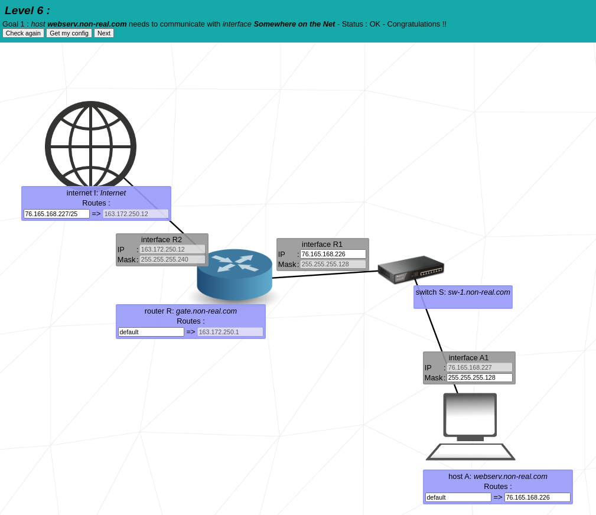
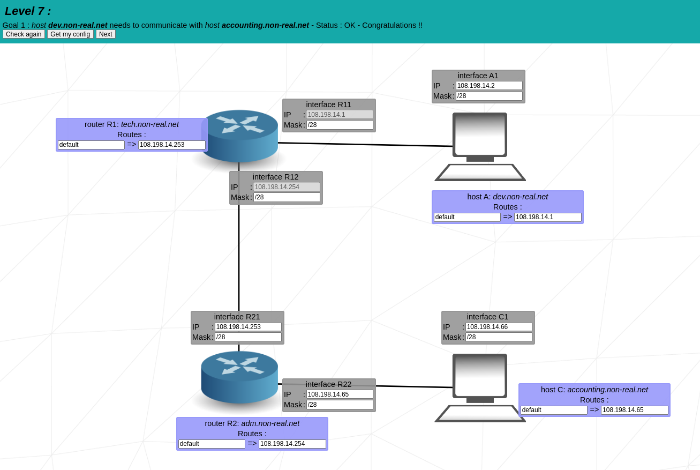
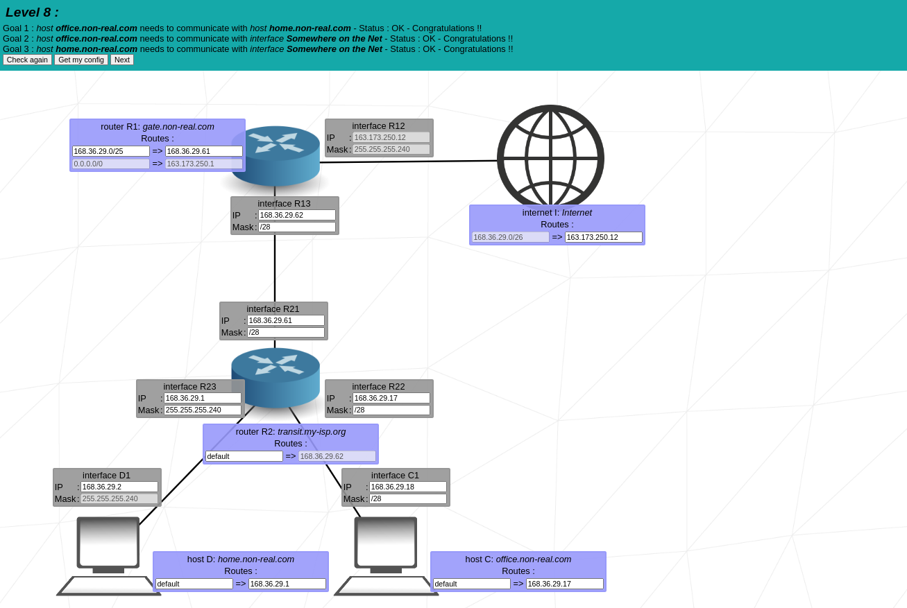
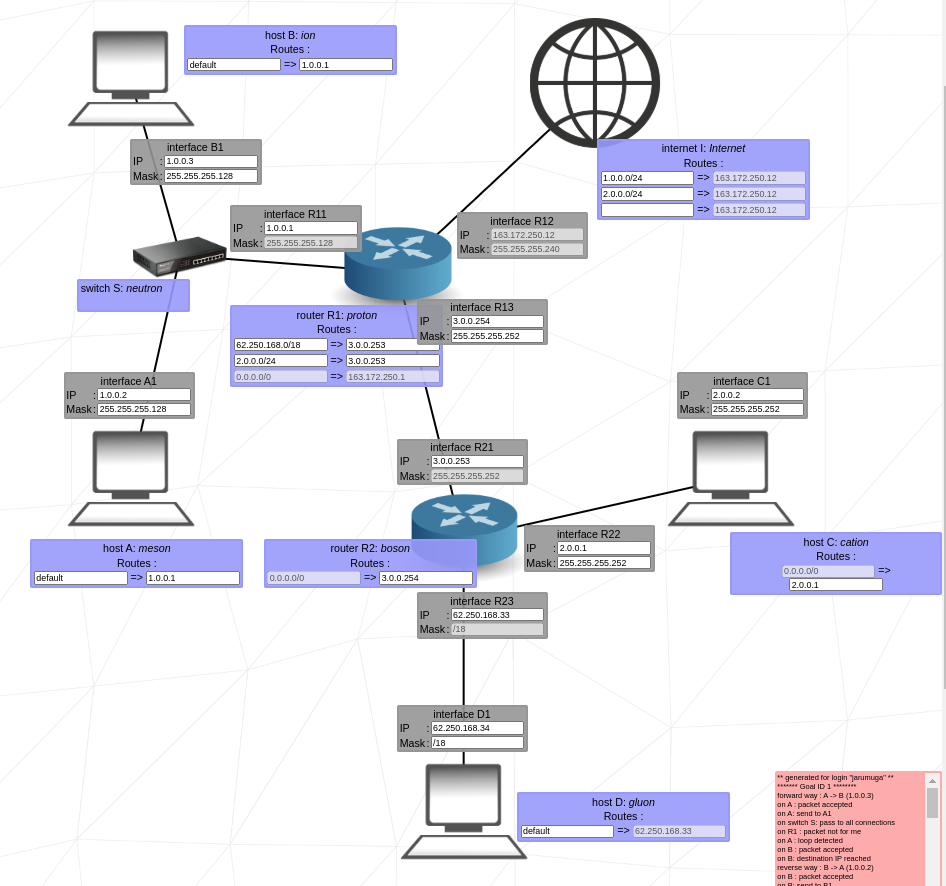
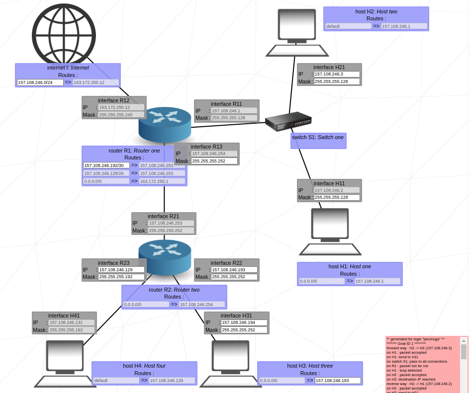

# 🖧 NetPractice 

NetPractice est un projet visant à apprendre les bases du réseau et de l'adressage IP.\
Il permet d'acquérir une compréhension approfondie des concepts liés aux adresses IP, aux sous-réseaux, aux masques, au routage et aux protocoles de communication.

---
## 📖 Definitions

### 🔹 **Adresse IP (Internet Protocol)**
Une adresse IP est un identifiant unique attribué à chaque appareil connecté à un réseau informatique. Elle permet aux machines de s’identifier et de communiquer entre elles sur Internet ou un réseau local.  
**Format IPv4 :** 4 nombres séparés par des points (ex. `192.168.1.1`), chacun représentant 8 bits, soit un total de **32 bits**.

### 🔹 **Masque de sous-réseau**
Un masque de sous-réseau est un ensemble de bits qui détermine la partie **réseau** et la partie **hôte** d’une adresse IP. Il est souvent noté sous forme décimale pointée (ex. `255.255.255.0`) ou en notation CIDR (`/24` indique que les 24 premiers bits sont réservés à l’identification du réseau).  
**Exemple :**  
- `192.168.1.10 / 255.255.255.0` → La partie réseau est `192.168.1.x`, la partie hôte est `x`.

### 🔹 **Routage**
Le routage est le processus de transmission de données d’un réseau à un autre via des équipements appelés **routeurs**. Il utilise des **tables de routage** pour déterminer le chemin optimal qu’un paquet de données doit emprunter.

### 🔹 **Switch (Commutateur)**
Un switch est un équipement réseau qui connecte plusieurs appareils au sein d’un **réseau local (LAN)**. Contrairement à un routeur, il fonctionne uniquement au niveau **du réseau interne** et ne gère pas l’interconnexion entre différents réseaux.

### 🔹 **Protocole TCP/IP**
Le **TCP/IP** est l’ensemble des règles qui régissent la transmission des données sur Internet. Il se compose de plusieurs couches :
- **TCP (Transmission Control Protocol)** : Assure la transmission fiable des paquets de données en garantissant leur ordre et leur intégrité.
- **IP (Internet Protocol)** : Assure l’adressage et le routage des paquets à travers les réseaux.

### 🔹 **Notation CIDR (Classless Inter-Domain Routing)**
La notation **CIDR** est une méthode permettant de représenter efficacement une plage d’adresses IP et son masque de sous-réseau. Elle simplifie l’écriture et optimise l'utilisation des adresses.  
**Exemple :**  
- `192.168.1.0/24` signifie que les **24 premiers bits** définissent le réseau et que les **8 bits restants** sont dédiés aux hôtes.

## 📌 1. Unicité de l’adresse IP

Lorsqu’une communication réseau est établie, trois éléments sont essentiels :
1. **Le nom de la machine distante** : Qui est l’hôte distant ?
2. **L’adresse IP** : Où se trouve cet hôte ?
3. **Le chemin d’accès** : Comment y parvenir ?

Les machines communiquent uniquement en **binaire**. Une adresse IP (version 4 - IPv4) est standardisée sur **32 bits**, ce qui permet de structurer l'adressage réseau.

###  Deux informations clés contenues dans une adresse IPv4 :
- **L’adresse réseau**
- **L’adresse de l’hôte**

Ces deux éléments forment ensemble une **adresse unique** sur un réseau.

---

## 📌 2. Délivrance des adresses IPv4

### **Adresses privées**
- Tout administrateur réseau peut attribuer librement des adresses **privées**, tant qu’elles restent **hors-ligne**.
- Définies par la RFC **1918**.

### **Adresses publiques**
- Délivrées par des **organismes mondiaux** assurant leur unicité.
- Fournies généralement par les **FAI** (Fournisseurs d’Accès Internet).

### 📊 **Classification des adresses IP**
| Classe | Réseau | Hôtes |
|--------|--------|------|
| **A**  | 1 octet | 3 octets |
| **B**  | 2 octets | 2 octets |
| **C**  | 3 octets | 1 octet |

---

## 📌 3. Routeurs et commutateurs

### **Routeur**
- Permet de **connecter plusieurs réseaux** entre eux.
- Possède autant d’interfaces réseau que de connexions.
- Veille à ce que les adresses d’un réseau ne passent pas vers un autre réseau.

### **Switch (commutateur)**
- Relie les machines d’un réseau local 🏠 (LAN).
- Fonctionne avec des **ports RJ45** pour connecter les équipements.
- Un réseau local peut accéder à Internet via un **routeur**.

---

## 📌 4. Adresses particulières

| Type d’adresse | Description |
|---------------|-------------|
| **Loopback** | `127.0.0.1` - Adresse permettant à un PC de communiquer avec lui-même |
| **Adresse non spécifiée** | `0.0.0.0` - Désigne toutes les interfaces |
| **Adresses privées** | `192.168.X.Y` ou `10.X.X.X` pour les réseaux internes |
| **APIPA** | `169.254.X.X` - Assignation automatique lorsqu’aucun serveur DHCP n’est trouvé |
| **Broadcast** | `255.255.255.255` - Message envoyé à tous les appareils d’un réseau |

---

## 📌 5. Masques de sous-réseau

Un **masque de sous-réseau** permet de séparer :
- **La partie réseau**
- **La partie hôte**

### 📝 **Exemple :**
- **IP** : `192.168.1.10`
- **Masque** : `255.255.255.0`
- **En binaire** : `192.168.1.10 -> 11000000.10101000.00000001.00001010 255.255.255.0 -> 11111111.11111111.11111111.00000000`

- Partie **réseau** : `192.168.1.0`
- Partie **hôte** : `.10`

📌 **Notation CIDR** :
- `192.168.1.0/24` signifie que **les 24 premiers bits** définissent le réseau.
- `2^(32-24) = 256` adresses possibles.

---

## 📌 6. Le protocole TCP/IP

### **TCP (Transmission Control Protocol)**
- **Protocole de communication fiable** assurant la transmission des données 📦.
- Avant d’envoyer des données, il établit une **connexion (handshake)**.
- **Garantit l’ordre des paquets** et retransmet ceux qui sont perdus.
- **Gère la congestion** pour éviter d’encombrer le réseau.

### **Routage des paquets**
- Les paquets IP transitent à travers différents réseaux pour atteindre leur destination.
- Utilisation des **tables de routage** pour définir le chemin optimal.

---

## 📌 7. Opération AND et Masque réseau

L’opération **AND** est utilisée pour déterminer l’adresse réseau d’une machine.

### 📝 **Exemple :**
| Bit 1 | Bit 2 | Résultat |
|------|------|------|
| 0 | 0 | 0 |
| 0 | 1 | 0 |
| 1 | 0 | 0 |
| 1 | 1 | 1 |

Avec :
- **Adresse IP** : `192.168.1.10`
- **Masque réseau** : `255.255.255.0`

La conversion en binaire et l’opération AND permettent de déterminer **l’adresse réseau** `192.168.1.0`.

---

## 📌 8. Exercices NetPractice

### Le projet NetPractice propose **10 niveaux** progressifs permettant de tester ses connaissances en adressage réseau.

  
Niveau 6 - Configuration de base du routage

   

  

    

  **Notions abordées :**
  - **Adresse IP et Masque de sous-réseau** : Chaque appareil possède une adresse IP unique attribuée à son interface.
  - **Passerelle par défaut** : Un hôte doit avoir une passerelle configurée pour acheminer le trafic en dehors de son réseau local.
  - **Routage statique** : L'ajout manuel d'une route permettant la communication entre différents sous-réseaux.

  **Objectif :** Assurer la communication entre `webserv.non-real.com` et `Somewhere on the Net`.

  **Explication détaillée :**
  1. L'hôte `webserv.non-real.com` est connecté à un switch qui lui attribue une adresse IP `76.165.168.227/25` et un masque `255.255.255.128`. 
  2. Pour sortir de son réseau, il doit envoyer le trafic vers la passerelle `76.165.168.226`, qui est une interface du routeur `gate.non-real.com`.
  3. Le routeur `gate.non-real.com` possède une route par défaut pointant vers `163.172.250.1`, qui est l'interface du routeur de l'Internet.
  4. L'Internet doit avoir une route qui redirige les paquets en provenance de `webserv.non-real.com` vers l'adresse `163.172.250.12`, assurant ainsi la connectivité avec le réseau externe.

  **Configuration à appliquer :**
  - Ajouter une **route par défaut** sur `webserv.non-real.com` vers `76.165.168.226`.
  - Configurer le routeur `gate.non-real.com` pour rediriger le trafic sortant vers `163.172.250.1`.
  - Vérifier que l'Internet connaît la route de retour vers `webserv.non-real.com`.

  **Points importants :**
  - Il est crucial d’avoir une **route par défaut** pour tout le trafic sortant.
  - Assurer que les masques de sous-réseaux correspondent sur toutes les interfaces.
  - Vérifier la cohérence des routes sur chaque machine.

Pour acceder a Internet, on définit en general ce qu’on appelle une « route par défaut ». 

C’est cette route qui permet d’envoyer tout le trafic inconnu (c’est-à-dire destiné à n’importe quelle adresse IP qui n’est pas sur le réseau local) vers la passerelle/routeur qui a lui-même accès à Internet.

**Pourquoi 0.0.0.0 comme destination ?**
- **Destination** : dans un tableau de routage, cette colonne indique la plage d’adresses IP à laquelle s’applique la route. Pour dire « toutes les adresses possibles » (c’est-à-dire l’intégralité d’Internet), on utilise l’adresse réseau 0.0.0.0 avec un masque 0.0.0.0.

- **Interprétation**: 0.0.0.0/0 signifie « peu importe l’adresse de destination », c’est la route de dernier recours (ou route par défaut).

Par exemple, si votre routeur local qui mène à Internet a l’adresse 192.168.1.1 sur le réseau local, votre route ressemblera à ceci :

  Destination  | Masque       | Passerelle
  0.0.0.0      | 0.0.0.0      | 192.168.1.1
_Cela signifie : « Pour tout ce qui n’est pas sur un réseau déjà connu par d’autres routes, envoie le trafic vers 192.168.1.1 »._

Rôle exact de la « destination » dans ce contexte
Lorsque vous ajoutez une route, vous indiquez pour quelles adresses IP cette route est valable.
Dans le cas de la route par défaut, la « destination » est donc 0.0.0.0/0 (toutes les adresses), ce qui couvre littéralement toutes les destinations possibles sur Internet.

  
Niveau 7 - Communication entre sous-réseaux

   

  

    

  **Notions abordées :**
  - **Segmentation des réseaux** : Le réseau est divisé en plusieurs sous-réseaux avec des masques adaptés.
  - **Routage statique** : Chaque routeur doit être configuré manuellement pour relier les sous-réseaux.
  - **Passerelle et routes par défaut** : Les hôtes doivent avoir une passerelle configurée pour envoyer les paquets en dehors de leur sous-réseau.

  **Objectif :** Assurer la communication entre `dev.non-real.net` et `accounting.non-real.net`.

  **Explication détaillée :**
  1. L'hôte `dev.non-real.net` (IP `108.198.14.2/28`) est connecté à un switch, qui est relié au routeur `tech.non-real.net` via l'interface `R11` (`108.198.14.1`).
  2. Pour atteindre `accounting.non-real.net`, `dev.non-real.net` doit envoyer les paquets à sa **passerelle par défaut**, qui est `108.198.14.1`.
  3. Le routeur `tech.non-real.net` doit transférer le trafic vers le routeur `adm.non-real.net`, en utilisant l'interface `R12` (`108.198.14.254/28`).
  4. Le routeur `adm.non-real.net` doit ensuite rediriger les paquets vers l'interface `R22` (`108.198.14.65/28`), qui est connectée au réseau de `accounting.non-real.net`.
  5. L'hôte `accounting.non-real.net` (IP `108.198.14.66/28`) reçoit alors les paquets.

  **Configuration à appliquer :**
  - Ajouter une **route par défaut** sur `dev.non-real.net` pointant vers `108.198.14.1`.
  - Configurer le routeur `tech.non-real.net` pour rediriger le trafic destiné à `108.198.14.64/28` vers `108.198.14.254`.
  - Configurer le routeur `adm.non-real.net` pour transmettre les paquets vers `108.198.14.65/28`.
  - Vérifier que `accounting.non-real.net` peut envoyer des réponses en retour en s'assurant qu'il a une route par défaut pointant vers `108.198.14.65`.

  **Points importants :**
  - Chaque routeur doit avoir une route spécifique pour atteindre les sous-réseaux.
  - La passerelle par défaut sur chaque hôte doit être correctement configurée.
  - Vérifier les masques de sous-réseaux pour assurer la bonne segmentation du réseau.

  
Niveau 8 - Routage avancé

   

  

    

  **Notions abordées :**
  - **CIDR et sous-réseaux** : La notation CIDR permet d’optimiser l'utilisation des adresses IP en divisant les réseaux en sous-réseaux plus petits.
  - **Routage avancé** : Chaque routeur doit gérer plusieurs routes pour assurer la connectivité entre plusieurs sous-réseaux.
  - **Passerelle par défaut** : Chaque hôte doit avoir une route par défaut pointant vers le routeur adéquat pour atteindre d'autres réseaux.

  **Objectif :** Assurer la communication entre :
  - `office.non-real.com` et `home.non-real.com`.
  - `office.non-real.com` et l'**Internet**.
  - `home.non-real.com` et l'**Internet**.

  **Explication détaillée :**
  1. `office.non-real.com` (IP `168.36.29.18/28`) est connecté au routeur `transit.my-isp.org` via l'interface `C1`.
  2. `home.non-real.com` (IP `168.36.29.2/28`) est connecté au même routeur via l'interface `D1`.
  3. Le routeur `gate.non-real.com` connecte le réseau interne au monde extérieur via `163.173.250.12` (Internet).
  4. Pour que `office.non-real.com` puisse accéder à `home.non-real.com` :
     - Le routeur `transit.my-isp.org` doit acheminer les paquets entre les sous-réseaux `168.36.29.16/28` et `168.36.29.0/28`.
  5. Pour qu'ils puissent accéder à l'Internet :
     - Le routeur `transit.my-isp.org` doit transférer les paquets vers `168.36.29.62`, qui les enverra ensuite vers `163.173.250.12` (Internet).

  **Configuration à appliquer :**
  - **Sur `office.non-real.com`** : Ajouter une route par défaut pointant vers `168.36.29.17` (sa passerelle).
  - **Sur `home.non-real.com`** : Ajouter une route par défaut pointant vers `168.36.29.1` (sa passerelle).
  - **Sur le routeur `gate.non-real.com`** :
    - Ajouter une route vers `168.36.29.0/26` pointant vers `168.36.29.61`.
  - **Sur `transit.my-isp.org`** :
    - Assurer le routage entre `168.36.29.17` et `168.36.29.1`.
    - Ajouter une route par défaut pointant vers `168.36.29.62` pour atteindre Internet.

  **Points importants :**
  - Vérifier les **masques de sous-réseau** pour bien segmenter le réseau.
  - Les **routes statiques** doivent être bien configurées sur chaque routeur.
  - Chaque hôte doit avoir une **passerelle par défaut** correcte pour pouvoir envoyer des paquets en dehors de son sous-réseau.

  
Niveau 9 - Gestion des routes multiples

   

  

    

  **Notions abordées :**
  - **Routes spécifiques et routes par défaut** : Chaque hôte doit savoir où envoyer ses paquets en fonction de la destination.
  - **Communication à travers plusieurs routeurs** : Un paquet peut traverser plusieurs routeurs avant d’atteindre sa destination.
  - **Optimisation du routage** : Le routage doit être efficace et éviter les boucles.

  **Objectif :** Assurer la connectivité entre les différents hôtes en configurant correctement les routes.

  **Explication détaillée :**
  1. `meson` et `cation` doivent pouvoir communiquer avec Internet.
  2. `meson` est connecté au réseau `1.0.0.2/25`, et doit utiliser le routeur `proton` comme passerelle (`1.0.0.1`).
  3. `cation` est connecté au réseau `2.0.0.2/25`, et doit utiliser `proton` comme passerelle (`2.0.0.1`).
  4. `proton` doit router les paquets de `meson` et `cation` vers `boson` via `3.0.0.253/30`.
  5. `boson` gère la connexion finale vers Internet via `3.0.0.254`.

  **Configuration à appliquer :**
  - **Sur `meson`** :
    - Ajouter une route par défaut pointant vers `1.0.0.1`.
  - **Sur `cation`** :
    - Ajouter une route par défaut pointant vers `2.0.0.1`.
  - **Sur `proton`** :
    - Ajouter une route pour `1.0.0.0/24` et `2.0.0.0/24` pointant vers `3.0.0.253`.
  - **Sur `boson`** :
    - Ajouter une route par défaut vers `3.0.0.254` pour accéder à Internet.

  **Points importants :**
  - La communication nécessite que chaque routeur ait bien les **routes correctes** pour relayer les paquets.
  - Les **hôtes doivent avoir une passerelle par défaut** qui leur permet de sortir de leur réseau local.
  - Le **protocole de routage** utilisé ici est statique, nécessitant une configuration manuelle précise.

  
Niveau 10 - Routage complexe

   

  

    

  **Notions abordées :**
  - **Table de routage dynamique et statique** : Un routeur doit être configuré pour savoir où envoyer les paquets en fonction de leur destination.
  - **Gestion des infrastructures réseau complexes** : Plusieurs routeurs interconnectés doivent assurer une communication fluide.
  - **Utilisation de sous-réseaux pour optimiser l’adressage IP** : Permet d’optimiser la répartition des adresses IP disponibles.

  **Objectif :** Assurer la communication entre tous les hôtes du réseau en mettant en place un routage efficace.

  **Explication détaillée :**
  1. `Host A`, `Host B`, `Host C` et `Host D` doivent pouvoir communiquer entre eux et avec Internet.
  2. Plusieurs routeurs (`Router One`, `Router Two`, et les autres intermédiaires) doivent gérer la répartition des flux de données.
  3. Chaque hôte doit avoir une **passerelle par défaut** définie pour sortir de son sous-réseau.
  4. Le **protocole de routage utilisé** permet d'optimiser le chemin des paquets en fonction des tables de routage.

  **Configuration à appliquer :**
  - **Sur chaque hôte (`Host A`, `Host B`, etc.)** :
    - Ajouter une route par défaut pointant vers l’interface du routeur auquel il est connecté.
  - **Sur les routeurs (`Router One`, `Router Two`, etc.)** :
    - Ajouter des routes statiques pour diriger les paquets vers les bons sous-réseaux.
    - Assurer une redirection efficace vers Internet via la passerelle finale.

  **Points clés à retenir :**
  - Chaque routeur doit avoir **des entrées correctes dans sa table de routage**.
  - Une mauvaise configuration d’une route peut **bloquer toute la communication**.
  - Le **chemin optimal** est toujours privilégié pour éviter des boucles de routage inefficaces.

  **Conseils pour réussir :**
  - Vérifier la correspondance entre les **adresses IP et leurs masques**.
  - Tester la connectivité en simulant des envois de paquets (`ping`).
  - S’assurer que chaque route définie permet bien d’atteindre la destination souhaitée.

